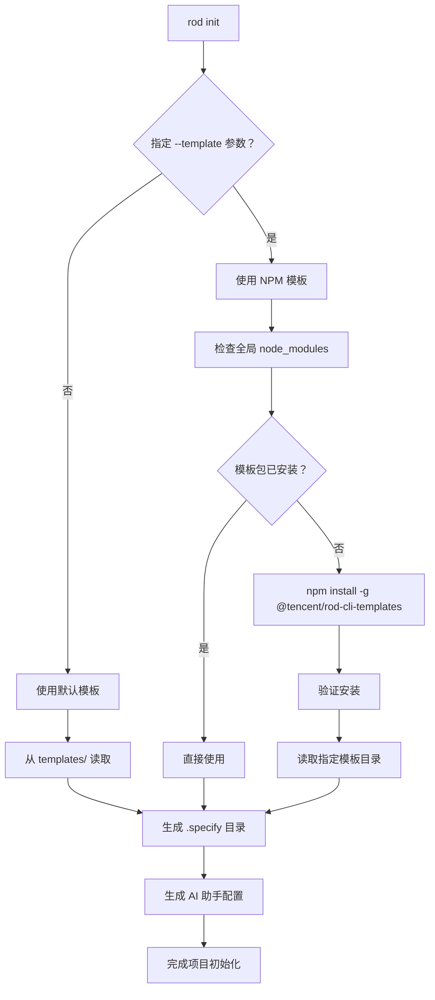

# ROD CLI 模板架构分析

## 概述

ROD CLI 支持两种模板系统：**默认模板**和**NPM 包模板**，通过灵活的架构设计实现本地生成和动态安装相结合的模板管理机制。

## 项目结构

```
rod-cli/
├── templates/                 # 默认模板（本地）
│   ├── commands/             # 通用 AI 命令模板
│   ├── memory/               # 项目宪法和记忆文件
│   ├── roadmap-template.md   # 路线图模板
│   ├── spec-template.md      # 规格模板
│   ├── plan-template.md      # 计划模板
│   └── tasks-template.md     # 任务模板
├── packages/                 # NPM 包模板存储
│   └── internal-templates/   # 内部模板包
│       ├── package.json      # NPM 包配置
│       ├── pui/              # PUI 模板
│       │   ├── commands/     # PUI 专用命令
│       │   └── memory/       # PUI 专用项目宪法
│       └── xdc/              # XDC 模板
└── src/
    ├── lib/
    │   ├── local-template-generator.ts  # 本地模板生成器
    │   └── npm-template-manager.ts      # NPM 模板管理器
    └── commands/
        └── init.ts                      # 初始化命令
```

## 模板系统架构

### 1. 默认模板系统

**位置**: `templates/` 目录
**用途**: 通用的 ROD 工作流模板，无需网络依赖
**特点**:
- 本地存储，启动速度快
- 支持多种 AI 助手 (Claude、Copilot、Gemini、Cursor、Codebuddy)
- 提供标准的规范驱动开发工作流

**模板结构**:
```
templates/
├── commands/              # 通用 AI 命令
│   ├── module.md         # 模块创建命令
│   ├── specify.md        # 规格分析命令
│   ├── plan.md           # 计划生成命令
│   ├── tasks.md          # 任务创建命令
│   └── progress.md       # 进度同步命令
├── memory/               # 项目宪法
│   └── constitution.md
└── *.md                  # 各种模板文件
```

### 2. NPM 包模板系统

**位置**: `packages/internal-templates/`
**包名**: `@tencent/rod-cli-templates`
**用途**: 腾讯内网专用模板，通过内网 NPM 分发

**核心特性**:
- 动态安装：首次使用时自动从内网 NPM 安装
- 全局缓存：使用 `npm install -g` 全局安装，提高复用性
- 版本管理：支持版本控制和更新机制
- 组织结构标准化：所有模板必须遵循统一的目录结构

**NPM 包结构**:
```
@tencent/rod-cli-templates/
├── pui/                  # PUI 模板（Vue3 + TDesign + 微信支付）
│   ├── commands/         # PUI 专用命令
│   │   ├── component.md  # Vue3+PUI 组件开发
│   │   ├── page.md       # 支付页面开发
│   │   └── optimize.md   # 项目优化
│   └── memory/           # PUI 专用项目宪法
│       └── constitution.md
├── xdc/                  # XDC 模板
│   ├── commands/
│   └── memory/
└── package.json          # NPM 包信息
```

## 模板使用流程

### 1. 初始化命令流程



### 2. 模板生成逻辑

**关键类**: `LocalTemplateGenerator` (src/lib/local-template-generator.ts:31)

**主要方法**:
- `generateTemplate()` - 主入口方法 (src/lib/local-template-generator.ts:146)
- `generateFromInternalTemplate()` - NPM 模板处理 (src/lib/local-template-generator.ts:208)
- `generateDefaultTemplate()` - 默认模板处理 (src/lib/local-template-generator.ts:230)

**处理流程**:
1. **模板选择**: 根据 `templateName` 参数决定使用默认模板还是 NPM 模板
2. **依赖确保**: 如果是 NPM 模板，调用 `NPMTemplateManager.ensureTemplate()` 确保安装
3. **目录生成**: 创建 `.specify/` 目录，复制模板文件
4. **AI 配置**: 根据 `aiAssistant` 参数生成对应的 AI 助手配置文件和命令

### 3. NPM 模板管理

**关键类**: `NPMTemplateManager` (src/lib/npm-template-manager.ts:27)

**核心方法**:
- `ensureTemplate()` - 确保模板可用 (src/lib/npm-template-manager.ts:190)
- `installTemplatePackage()` - 全局安装模板包 (src/lib/npm-template-manager.ts:96)
- `getTemplatePath()` - 获取模板路径 (src/lib/npm-template-manager.ts:80)

**安装策略**:
- 使用 `npm install -g @tencent/rod-cli-templates` 全局安装
- 安装路径: `{npm_global_modules}/@tencent/rod-cli-templates`
- 注册中心: `https://mirrors.tencent.com/npm/`

## 生成的项目结构

无论使用哪种模板，最终生成的项目都包含以下标准结构：

```
project/
├── .specify/                # 通用规范目录
│   ├── templates/          # 模板文件
│   ├── scripts/            # 脚本文件 (bash/powershell)
│   └── memory/             # 项目宪法
├── .{ai-assistant}/        # AI 助手配置目录
│   └── commands/           # AI 命令文件
├── .{ai-assistant}-config.json  # AI 配置文件（如需要）
└── specs/                  # 规范文档目录（roadmap 模式）
    ├── roadmap.md
    └── modules/
```

## AI 助手适配

### 支持的 AI 助手

1. **Claude**: 生成 `.claude/commands/` + `.claude-config.json`
2. **GitHub Copilot**: 生成 `.github/prompts/` (*.prompt.md 格式)
3. **Gemini**: 生成 `.gemini/commands/` + `.gemini-config.json` (*.toml 格式)
4. **Cursor**: 生成 `.cursor/commands/` (*.md 格式)
5. **Codebuddy**: 生成 `.codebuddy/commands/` (*.md 格式)

### 格式转换

**方法**: `convertToAIFormat()` (src/lib/local-template-generator.ts:962)

- **Gemini**: 转换为 TOML 格式
- **其他**: 保持 Markdown 格式，添加 AI 特定元数据

## 配置管理

### 参数传递流程

1. **命令行参数**: `rod init --template pui --ai claude`
2. **参数解析**: `InitCommand.execute()` (src/commands/init.ts:29)
3. **配置创建**: 包含 `templateName: args.template` (src/commands/init.ts:55)
4. **模板生成**: 传递给 `LocalTemplateGenerator.generateTemplate()`

### 模板路径解析

**默认模板路径**: `__dirname/../../templates` (src/lib/local-template-generator.ts:38)
**内部模板路径**: `__dirname/../../packages/internal-templates` (src/lib/local-template-generator.ts:40)
**NPM 模板路径**: `{npm_global_modules}/@tencent/rod-cli-templates/{templateName}`

## 设计优势

1. **本地优先**: 默认模板无需网络，启动快速
2. **按需安装**: NPM 模板仅在需要时安装，减少包体积
3. **全局复用**: NPM 模板全局安装，多项目共享
4. **版本管理**: 通过 NPM 实现模板版本控制和更新
5. **标准化**: 统一的模板结构和生成流程
6. **多 AI 支持**: 一套模板适配多种 AI 助手

## 扩展机制

### 添加新模板

1. **NPM 包模板**: 在 `packages/internal-templates/` 下创建新目录
2. **发布更新**: 更新 `@tencent/rod-cli-templates` 包版本
3. **使用**: `rod init --template new-template-name`

### 添加新 AI 助手

1. **枚举扩展**: 在 `AIAssistant` 枚举中添加新值
2. **目录映射**: 在 `getAIDirectoryName()` 中添加映射 (src/lib/local-template-generator.ts:722)
3. **格式转换**: 在 `convertToAIFormat()` 中添加格式处理
4. **配置生成**: 在 `generateAIConfig()` 中添加配置逻辑

这种双模板系统设计既保证了基础功能的稳定性和快速启动，又提供了内部模板的灵活性和可扩展性。~~~~
