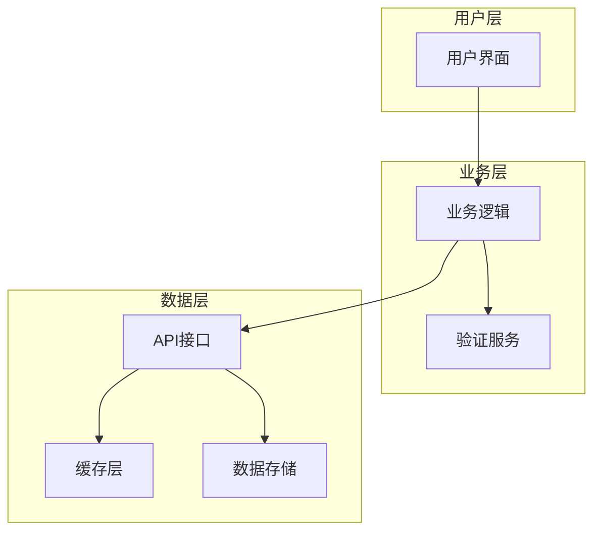
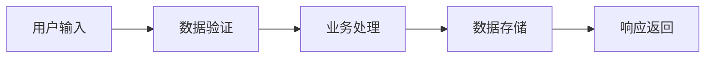
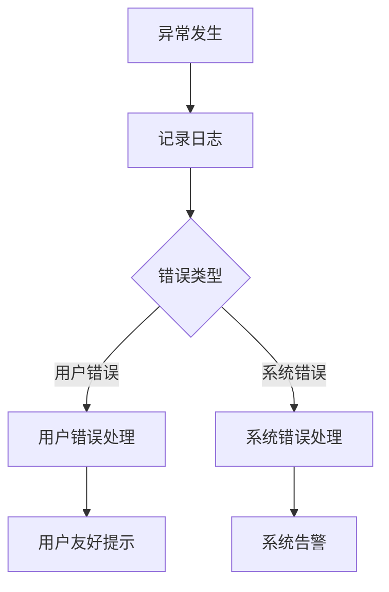

# 设计文档: [模块名称]

**模块路径**: `specs/modules/[模块路径]`  
**基于需求**: [spec.md链接]  
**创建时间**: [创建时间]  
**最后更新**: [最后更新时间]  
**状态**: 设计中/审核中/已批准  

## 概述

### 设计目标
[基于需求文档的设计目标和技术目标]

### 技术决策
[关键技术选型和决策理由]

### 依赖关系
- **上游依赖**: [依赖的其他模块]
- **下游影响**: [影响的其他模块]
- **外部依赖**: [第三方服务/库]

## 架构设计

### 整体架构


### 关键设计模式
- **设计模式1**: [使用场景和理由]
- **设计模式2**: [使用场景和理由]

## 组件和接口

### 核心组件

#### 组件1: [组件名称]
**职责**: [组件职责描述]  
**接口**:
```typescript
interface Component1Interface {
  method1(param: Type): ReturnType;
  method2(param: Type): Promise<ReturnType>;
}
```

**实现要点**:
- [要点1]
- [要点2]

#### 组件2: [组件名称]
**职责**: [组件职责描述]  
**状态管理**:
```typescript
interface Component2State {
  property1: Type;
  property2: Type;
}
```

### API接口设计

#### REQ-001对应接口
**需求来源**: [REQ-001需求描述]
```typescript
// POST /api/module/action
interface ActionRequest {
  field1: string;
  field2: number;
}

interface ActionResponse {
  success: boolean;
  data: ResultType;
  message?: string;
}
```

#### REQ-002对应接口  
**需求来源**: [REQ-002需求描述]
```typescript
// GET /api/module/query
interface QueryParams {
  filter: string;
  page: number;
}

interface QueryResponse {
  items: ItemType[];
  total: number;
}
```

## 数据模型

### 核心实体

#### Entity1
```typescript
interface Entity1 {
  id: string;
  name: string;
  status: 'active' | 'inactive';
  createdAt: Date;
  updatedAt: Date;
}
```

#### Entity2
```typescript
interface Entity2 {
  id: string;
  entity1Id: string;
  properties: Record<string, any>;
}
```

### 数据流图


## 错误处理

### 错误分类
| 错误类型 | 错误码 | 处理策略 | 用户提示 |
|---------|-------|----------|----------|
| 参数错误 | 400-001 | 参数验证 | 请检查输入参数 |
| 权限错误 | 403-001 | 权限检查 | 无操作权限 |
| 业务错误 | 500-001 | 业务处理 | 操作失败，请重试 |

### 异常处理流程


## 测试策略和验收测试设计

### 测试层级

#### 单元测试
- **组件1测试**: [测试要点]
- **组件2测试**: [测试要点]
- **工具函数测试**: [测试要点]

#### 集成测试
- **API集成测试**: [测试场景]
- **组件集成测试**: [测试场景]

#### 端到端测试
基于需求文档的验收标准设计：

##### REQ-001验收测试
**场景**: [基于REQ-001的测试场景]
```gherkin
Feature: REQ-001功能验证

Scenario: [具体场景]
  Given [前置条件]
  When [执行操作]
  Then [验证结果]
  And [附加验证]
```

**自动化实现**:
```typescript
test('REQ-001: [需求标题]', async () => {
  // Given: 前置条件准备
  
  // When: 执行操作
  
  // Then: 验证结果
  expect(result).toBe(expected);
});
```

##### REQ-002验收测试
**场景**: [基于REQ-002的测试场景]
```gherkin
Feature: REQ-002功能验证

Scenario: [具体场景]
  Given [前置条件]
  When [执行操作]  
  Then [验证结果]
```

### 测试数据策略
- **静态测试数据**: [数据准备策略]
- **动态测试数据**: [数据生成策略]
- **测试环境**: [环境配置]

### 验收标准映射
| 需求ID | 验收标准 | 测试类型 | 实现状态 |
|-------|---------|----------|----------|
| REQ-001 | [验收标准1] | E2E + Unit | 待实现 |
| REQ-002 | [验收标准2] | Integration | 待实现 |
| REQ-003 | [验收标准3] | E2E | 待实现 |

## 性能考虑

### 性能目标
- **响应时间**: [目标值]
- **并发处理**: [目标值]
- **资源消耗**: [目标值]

### 优化策略
- **缓存策略**: [缓存方案]
- **异步处理**: [异步策略]
- **资源优化**: [优化方案]

## 安全考虑

### 安全措施
- **身份认证**: [认证机制]
- **权限控制**: [权限策略]
- **数据保护**: [保护措施]

### 安全检查点
- [ ] 输入验证完整
- [ ] 权限控制到位
- [ ] 敏感数据加密
- [ ] 日志记录完整

## 部署和运维

### 部署要求
- **环境依赖**: [依赖列表]
- **配置项**: [配置说明]
- **启动脚本**: [脚本说明]

### 监控指标
- **业务指标**: [关键业务指标]
- **技术指标**: [技术监控指标]
- **告警策略**: [告警规则]

## 设计决策记录

### [日期] - [决策标题]
**问题**: [需要决策的问题]  
**方案**: [选择的方案]  
**理由**: [选择理由]  
**权衡**: [考虑的其他方案]  
**影响**: [对其他模块的影响]  

---

## 设计审核清单

### 需求一致性
- [ ] 设计完全满足所有需求（REQ-XXX）
- [ ] 每个需求都有对应的技术实现方案
- [ ] 验收标准都有对应的测试设计

### 技术合理性
- [ ] 技术选型合理
- [ ] 架构设计清晰
- [ ] 接口设计完整
- [ ] 错误处理完善

### 可实现性
- [ ] 设计可以分解为具体的开发任务
- [ ] 依赖关系明确
- [ ] 风险点已识别
- [ ] 测试策略可执行

---

*设计状态：待审核 | 审核人：[审核人] | 批准日期：[日期]*