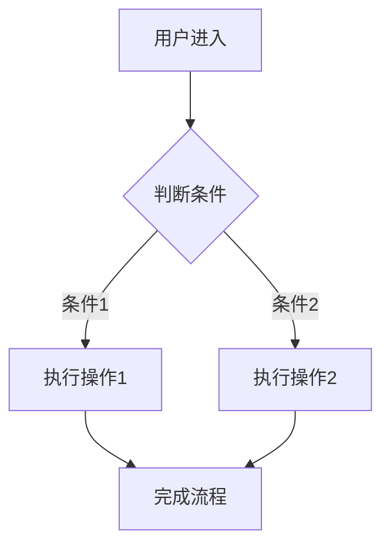
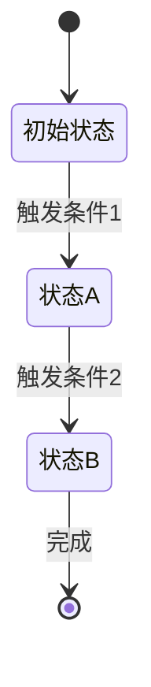

# 需求文档: [模块名称]

**模块路径**: `specs/modules/[模块路径]`  
**创建时间**: [创建时间]  
**最后更新**: [最后更新时间]  
**状态**: 草稿/审核中/已批准  

## 第1部分：背景说明

### 业务背景
[说明该模块的业务背景、目标用户和解决的核心问题]

### 核心目标
[明确该模块要达成的业务目标]

### 设计参考
[如存在 page.png 设计稿，在此说明参考的设计要点]

## 第2部分：需求概览与业务流程

### 业务流程图


### 状态机（如需要）


### 关键业务规则
- 规则1：[具体规则描述]
- 规则2：[具体规则描述]

## 第3部分：EARS格式关键需求条目

### REQ-001: [需求标题]
**WHEN** [触发条件]  
**THE SYSTEM SHALL** [系统响应]  
**WHERE** [约束条件]  
**AND** [附加条件]  

**验收标准**:
- [ ] 验收点1：[具体可测试的标准]
- [ ] 验收点2：[具体可测试的标准]
- [ ] 验收点3：[具体可测试的标准]

**标签**: #[业务分类] #[优先级] #[模块标识]

---

### REQ-002: [需求标题]
**WHEN** [触发条件]  
**THE SYSTEM SHALL** [系统响应]  
**WHERE** [约束条件]  
**AND** [附加条件]  

**验收标准**:
```gherkin
场景: [场景描述]
Given [前置条件]
When [执行操作]
Then [预期结果]
And [附加验证]
```

**标签**: #[业务分类] #[优先级] #[模块标识]

---

### REQ-003: [需求标题]
**WHEN** [触发条件]  
**THE SYSTEM SHALL** [系统响应]  

**验收标准**:
| 输入条件 | 系统行为 | 预期结果 |
|---------|----------|----------|
| [条件1] | [行为1] | [结果1] |
| [条件2] | [行为2] | [结果2] |

**标签**: #[业务分类] #[优先级] #[模块标识]

## 需求审核清单

### 完整性检查
- [ ] 所有需求都有明确的触发条件（WHEN）
- [ ] 所有需求都有明确的系统响应（THE SYSTEM SHALL）
- [ ] 每个需求都有可测试的验收标准
- [ ] 业务流程图覆盖了所有关键路径

### 业务正确性检查  
- [ ] 需求符合业务目标
- [ ] 避免了技术实现细节
- [ ] 用户角色和权限定义清晰
- [ ] 异常情况处理规则明确

### 可追溯性检查
- [ ] 需求ID命名规范（REQ-XXX）
- [ ] 需求标签完整
- [ ] 与业务流程图节点对应
- [ ] 验收标准可直接转换为测试用例

---

## 需求变更记录

### [日期] - v1.1
**变更内容**: [变更描述]  
**影响范围**: [影响的需求ID]  
**变更原因**: [变更原因]  

---

*文档状态：需要审核 | 审核人：[审核人] | 批准日期：[日期]*