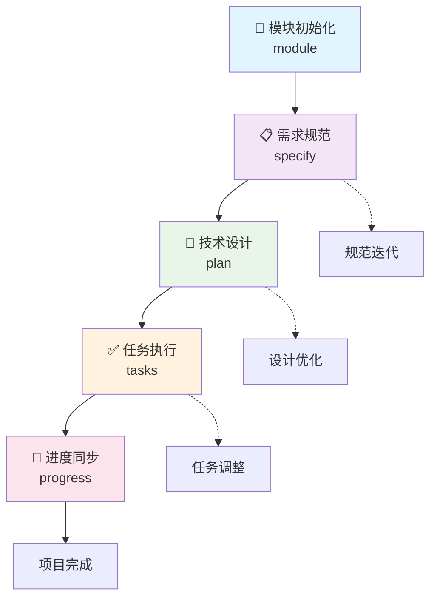

# ROD 规范驱动开发工作流

## 🌟 工作流概述

ROD (Rules-Oriented Development) 工作流基于规范驱动开发的理念，将规范作为开发的核心驱动力，而不是辅助文档。在这个工作流中，**规范成为可执行的开发指令**，代码成为规范的具体表达。

### 核心理念转变

**传统开发模式**：代码为王，规范服务于代码
- 写 PRD → 做设计 → 写代码 → 维护代码
- 规范只是指导，代码才是真理
- 需求变更需要手动同步到代码

**ROD 规范驱动模式**：规范为王，代码服务于规范
- 写规范 → 生成设计 → 生成代码 → 维护规范
- 规范是真理，代码是表达
- 需求变更通过更新规范自动传播

## 🔄 五阶段工作流

ROD 工作流采用系统化的五阶段流程，每个阶段都有明确的输入、处理和输出：



### 阶段 1: 📂 模块初始化 (`/module`)

**目标**: 建立清晰的项目结构和模块边界

**输入**: 模块名称或功能领域描述
**处理**: 创建模块目录结构，建立开发环境
**输出**: `specs/modules/{模块名}/` 目录结构

**命令**: `/module user-auth payment-system`

**工作原理**:
1. 分析项目需求，识别功能模块
2. 创建独立的模块目录，支持并行开发
3. 建立模块间的依赖关系和接口定义
4. 为每个模块提供独立的开发空间

**最佳实践**:
- 模块应该具有清晰的业务边界
- 避免过度细分或过度聚合
- 考虑团队分工和并行开发需求
- 建立合理的模块依赖关系

### 阶段 2: 📋 需求规范 (`/specify`)

**目标**: 将业务需求转化为精确、可执行的规范文档

**输入**: 功能描述、业务需求、用户故事
**处理**: 基于 EARS 方法论创建结构化规范
**输出**: `spec.md` - 详细的功能规范文档

**命令**: `/specify 实现用户登录功能，支持邮箱和手机号登录，包含忘记密码流程`

**工作原理**:
1. 收集和分析业务需求
2. 使用 EARS 格式 (易于评审、可实现、明确、相关、可测试) 组织需求
3. 定义清晰的验收标准和业务规则
4. 建立需求可追溯性和版本管理

**规范质量标准**:
- **易于评审 (Easy to Review)**: 规范结构清晰，便于审查
- **可实现 (Achievable)**: 技术上可行，资源上合理
- **明确 (Unambiguous)**: 表达清晰，不会产生歧义
- **相关 (Relevant)**: 与业务目标直接相关
- **可测试 (Testable)**: 具有明确的验收标准

**规范内容结构**:
```markdown
# 功能规范: [功能名称]

## 业务背景
- 业务场景和价值
- 用户痛点和需求

## 功能需求
- 核心功能列表
- 用户故事和场景

## 验收标准
- 明确的验收条件
- 测试场景定义

## 业务规则
- 约束条件
- 异常处理

## 接口约定
- 与其他模块的交互
- 数据流转规则
```

### 阶段 3: 🎯 技术设计 (`/plan`)

**目标**: 将业务规范转化为技术实现方案

**输入**: `spec.md` 功能规范、技术约束、架构原则
**处理**: 生成详细的技术实现计划
**输出**: `plan.md` - 技术设计文档

**命令**: `/plan 使用 JWT 认证，Redis 缓存，PostgreSQL 存储用户信息`

**工作原理**:
1. 分析功能规范，理解业务需求
2. 应用技术约束和架构原则
3. 选择合适的技术栈和实现方案
4. 设计数据模型、API 接口和系统架构
5. 生成实现的技术路径和决策依据

**技术设计要素**:
- **架构设计**: 系统结构、组件划分、数据流
- **技术选型**: 框架、库、工具的选择和理由
- **数据设计**: 数据模型、存储方案、缓存策略
- **接口设计**: API 规范、通信协议、集成方案
- **安全设计**: 认证授权、数据保护、安全策略
- **性能设计**: 性能目标、优化策略、监控方案

**设计原则**:
- 基于规范驱动，确保实现与需求一致
- 遵循项目宪法中的技术约束
- 考虑可维护性、可扩展性、可测试性
- 平衡技术先进性与项目实际需求

### 阶段 4: ✅ 任务执行 (`/tasks`)

**目标**: 将技术设计分解为可执行的开发任务

**输入**: `plan.md` 技术设计、开发资源、时间约束
**处理**: 生成详细的任务分解和执行计划
**输出**: `tasks.md` - 开发任务清单

**命令**: `/tasks`

**工作原理**:
1. 分析技术设计，识别实现要素
2. 将复杂设计分解为独立的开发任务
3. 识别任务间的依赖关系和并行机会
4. 估算工作量和时间，制定执行计划
5. 建立质量检查点和测试策略

**任务分解策略**:
- **按功能分解**: 将大功能拆分为小功能点
- **按技术层次分解**: 前端、后端、数据库、集成等
- **按开发阶段分解**: 搭建、核心逻辑、测试、优化
- **按并行度分解**: 识别可并行执行的独立任务

**任务类型**:
- **开发任务**: 具体的代码实现工作
- **测试任务**: 单元测试、集成测试、端到端测试
- **集成任务**: 模块集成、第三方服务集成
- **部署任务**: 环境配置、部署脚本、监控设置
- **文档任务**: API 文档、使用说明、运维文档

**任务标记约定**:
- `[P]` - 可并行执行的任务
- `[D:task-name]` - 依赖其他任务完成
- `[CRITICAL]` - 关键路径任务
- `[OPTIONAL]` - 可选或延期任务

### 阶段 5: 🔄 进度同步 (`/progress`)

**目标**: 同步模块进度，维护项目整体状态

**输入**: 模块完成状态、测试结果、质量指标
**处理**: 更新项目进度，识别阻塞和风险
**输出**: 更新的 `specs/roadmap.md` 项目路线图

**命令**: `/progress`

**工作原理**:
1. 评估当前模块的完成状态
2. 更新项目整体进度和里程碑
3. 识别模块间的依赖影响
4. 生成进度报告和风险预警
5. 调整后续开发计划和资源分配

**进度跟踪要素**:
- **完成度指标**: 功能完成、测试通过、质量达标
- **质量指标**: 代码覆盖率、性能指标、安全检查
- **风险指标**: 技术风险、进度风险、资源风险
- **依赖关系**: 模块间依赖、外部依赖、资源依赖

## 🎯 工作流特色

### 1. 规范驱动的开发模式

**传统问题**: 需求与实现容易脱节，变更传播困难
**ROD 解决方案**: 规范成为开发的唯一真理源

- 所有开发活动都基于规范文档
- 代码变更通过更新规范来驱动
- 规范与实现保持强一致性

### 2. 模块化的项目架构

**传统问题**: 大型项目难以管理，团队协作复杂
**ROD 解决方案**: 清晰的模块边界和独立的开发流程

- 每个模块有独立的规范和设计
- 支持团队并行开发和独立交付
- 模块间通过明确的接口协作

### 3. 迭代式的质量提升

**传统问题**: 质量问题在后期才暴露，修复成本高
**ROD 解决方案**: 每个阶段都有质量门禁

- 规范阶段确保需求质量
- 设计阶段确保架构质量
- 任务阶段确保实现质量
- 同步阶段确保整体质量

### 4. 自动化的工作流程

**传统问题**: 手工流程容易出错，效率低下
**ROD 解决方案**: 通过脚本和模板自动化常见操作

- 自动创建目录结构和模板文件
- 自动分析模块依赖和状态
- 自动生成报告和进度更新

## 🛠️ 实践指导

### 新手入门流程

1. **学习规范驱动理念** (15 分钟)
   - 理解规范优先的开发思维
   - 了解五阶段工作流程
   - 熟悉命令和工具

2. **创建第一个模块** (30 分钟)
   ```bash
   /module hello-world
   cd specs/modules/hello-world
   /specify 创建一个简单的问候功能，输入用户名输出个性化问候
   /plan 使用 Node.js 实现，支持命令行和 Web 接口
   /tasks
   ```

3. **完成实现和同步** (根据任务复杂度)
   - 按照 tasks.md 完成开发工作
   - 运行测试确保质量
   - 执行 `/progress` 更新状态

### 团队协作最佳实践

1. **规范评审机制**
   - 规范完成后进行团队评审
   - 确保需求理解一致
   - 建立规范变更流程

2. **模块责任分工**
   - 每个模块指定负责人
   - 建立模块间协调机制
   - 定期同步依赖关系

3. **质量管理流程**
   - 每个阶段设置质量检查点
   - 建立持续集成和测试
   - 定期进行质量回顾

### 大型项目管理策略

1. **分层模块设计**
   ```
   specs/modules/
   ├── user-management/          # 用户管理领域
   │   ├── authentication/       # 认证子模块
   │   ├── authorization/        # 授权子模块
   │   └── profile/             # 用户资料子模块
   ├── payment-system/          # 支付系统领域
   └── order-management/        # 订单管理领域
   ```

2. **依赖关系管理**
   - 绘制模块依赖图
   - 识别关键路径和瓶颈
   - 合理安排开发顺序

3. **进度监控和调整**
   - 定期执行 `/progress` 更新状态
   - 监控关键指标和风险
   - 及时调整计划和资源

## 🔧 工具集成

### AI 助手集成

ROD 工作流支持多种 AI 助手，提供智能化的开发支持：

- **Claude**: 擅长复杂推理和架构设计
- **GitHub Copilot**: 强大的代码生成能力
- **Gemini**: 多模态分析和创新思维
- **Cursor**: 专注于代码编辑和重构

### 脚本自动化

内置的 Node.js 脚本提供强大的自动化支持：

- `analyze-modules.js` - 分析模块结构和依赖
- `create-module-spec.js` - 自动创建规范模板
- `generate-module-tasks.js` - 智能生成任务分解
- `sync-progress.js` - 自动同步项目进度

### 版本控制集成

ROD 工作流与 Git 深度集成：

- 每个模块可以使用独立的分支
- 规范变更通过 PR 进行评审
- 支持规范的版本管理和回滚

## 📈 效益分析

### 开发效率提升

- **需求分析效率**: 从数天的会议讨论缩短为数小时的规范编写
- **设计效率**: 自动生成技术方案，减少重复设计工作
- **实现效率**: 清晰的任务分解，减少返工和调整
- **协作效率**: 明确的模块边界，支持团队并行工作

### 质量保障提升

- **需求质量**: EARS 方法论确保需求的可测试性
- **设计质量**: 规范驱动确保设计与需求一致
- **代码质量**: 任务驱动确保实现的完整性
- **整体质量**: 持续同步确保项目整体一致性

### 维护成本降低

- **需求变更**: 通过更新规范自动传播变更
- **技术债务**: 规范驱动减少技术债务积累
- **知识传承**: 完整的规范文档便于知识传承
- **团队协作**: 标准化流程减少沟通成本

## 🚀 进阶应用

### 多技术栈支持

ROD 工作流本身技术栈无关，可以应用于：

- **前端项目**: React、Vue、Angular 等
- **后端项目**: Node.js、Java、Python、Go 等
- **移动应用**: iOS、Android、Flutter、React Native 等
- **桌面应用**: Electron、Qt、WPF 等

### 领域特定扩展

通过创建专用模板，可以为特定领域提供定制化支持：

- **Web 应用**: 包含前后端集成、API 设计等专用模板
- **微服务**: 包含服务发现、配置管理等专用模板
- **数据分析**: 包含数据流水线、可视化等专用模板
- **AI/ML**: 包含模型训练、部署等专用模板

### 企业级扩展

在企业环境中，可以进一步扩展：

- **合规要求**: 集成安全审查、合规检查等
- **企业标准**: 整合企业架构标准和技术栈
- **治理流程**: 集成企业的开发和发布流程
- **监控分析**: 集成企业的监控和分析平台

---

## 结语

ROD 规范驱动开发工作流代表了软件开发方法论的重要进步。它不仅仅是一套工具和流程，更是一种思维方式的转变：从以代码为中心转向以规范为中心，从手工流程转向自动化流程，从个体开发转向团队协作。

通过采用 ROD 工作流，开发团队可以：
- 🎯 更准确地理解和实现业务需求
- 🚀 显著提升开发效率和质量
- 🤝 改善团队协作和项目管理
- 📈 降低维护成本和技术债务

ROD 工作流是一个不断演进的方法论，随着 AI 技术的发展和实践经验的积累，它将继续为软件开发带来更多的价值和可能性。